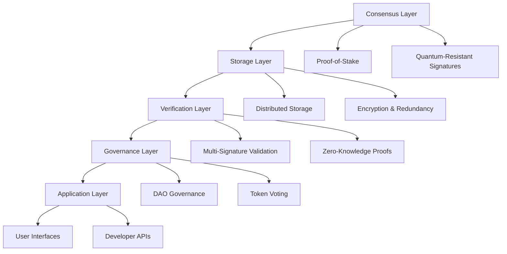

# Decentralized Rights Protocol (DRP)
## A Quantum-Safe Blockchain Platform for Human Rights Protection

### Abstract

The Decentralized Rights Protocol (DRP) represents a paradigm shift in human rights protection, leveraging quantum-safe blockchain technology to create an immutable, transparent, and globally accessible platform for documenting, verifying, and protecting human rights violations.

### 1. Introduction

Human rights violations continue to occur worldwide, often hidden from public view and difficult to verify. Traditional systems for documenting and protecting human rights are centralized, vulnerable to censorship, and lack transparency.

#### 1.1 The Problem

- **Centralization**: Current systems rely on centralized authorities that can be compromised
- **Censorship**: Information can be suppressed or manipulated by powerful entities
- **Lack of Transparency**: Verification processes are often opaque and unverifiable
- **Cross-border Issues**: International cooperation is limited by jurisdictional boundaries

#### 1.2 Our Solution

DRP addresses these critical issues by providing:

- Quantum-safe cryptographic protection for sensitive data
- Decentralized governance ensuring global participation
- Transparent verification mechanisms for human rights claims
- Cross-border interoperability for international collaboration
- Economic incentives for human rights defenders and validators

### 2. Technical Architecture

DRP is built on a multi-layered architecture that ensures security, scalability, and interoperability.

#### 2.1 Core Components

#### 2.2 Consensus Mechanism

DRP uses a modified Proof-of-Stake consensus mechanism with the following features:

- **Quantum-Safe Signatures**: Post-quantum cryptographic algorithms
- **Validator Selection**: Stake-weighted random selection
- **Finality**: Fast finality with economic security
- **Governance Integration**: Built-in governance participation

### 3. Security Model

Security is paramount in protecting human rights data. DRP implements multiple layers of protection:

#### 3.1 Cryptographic Security

- **Post-Quantum Cryptography**: Resistance against quantum computing attacks
- **Zero-Knowledge Proofs**: Privacy-preserving verification
- **Multi-Signature Schemes**: Distributed trust and validation
- **Homomorphic Encryption**: Computation on encrypted data

#### 3.2 Network Security

- **Decentralized Architecture**: No single point of failure
- **Validator Incentives**: Economic incentives for honest behavior
- **Slashing Conditions**: Penalties for malicious behavior
- **Network Monitoring**: Continuous security monitoring

### 4. Tokenomics

The DRP ecosystem is powered by two primary tokens:

#### 4.1 RIGHTS Token (Governance)

- **Total Supply**: 1,000,000,000 tokens
- **Distribution**: 
  - 40% Community rewards
  - 25% Development team
  - 20% Validators
  - 10% Partnerships
  - 5% Reserve fund
- **Staking Rewards**: 5-15% APY
- **Governance**: Voting power for protocol decisions

#### 4.2 DeRi Token (Utility)

- **Supply**: Deflationary with burn mechanism
- **Use Cases**:
  - Transaction fees
  - Service payments
  - Validator rewards
- **Burn Rate**: 0.1-1% of transaction value

### 5. Governance

DRP operates as a decentralized autonomous organization (DAO) where all stakeholders can participate in governance decisions.

#### 5.1 Governance Structure

- **Proposal System**: Community-driven proposal submission
- **Voting Mechanism**: Token-weighted voting with delegation
- **Execution**: Automated execution of approved proposals
- **Transparency**: All governance activities are publicly recorded

#### 5.2 Decision Categories

- Protocol upgrades and improvements
- Funding allocations for development
- Partnership and integration decisions
- Policy changes and updates

### 6. Roadmap

#### Phase 1: Foundation (Q1 2024)
- Core protocol development
- Initial testing and validation
- Community building

#### Phase 2: Testnet (Q2 2024)
- Public testnet launch
- Community feedback integration
- Security audits

#### Phase 3: Mainnet (Q3 2024)
- Mainnet deployment
- Token launch
- Initial partnerships

#### Phase 4: Growth (Q4 2024+)
- Ecosystem expansion
- Advanced features
- Global adoption

### 7. Conclusion

The Decentralized Rights Protocol represents a new paradigm in human rights protection, combining cutting-edge blockchain technology with a deep commitment to transparency, security, and global accessibility.

By leveraging quantum-safe cryptography and decentralized governance, DRP creates a platform that cannot be censored, manipulated, or shut down by any single entity.

We invite human rights defenders, technologists, and advocates worldwide to join us in building a more just and transparent future.

---

*For more information, visit [drp-protocol.org](https://drp-protocol.org) or join our community on [Discord](https://discord.gg/drp-protocol).*

